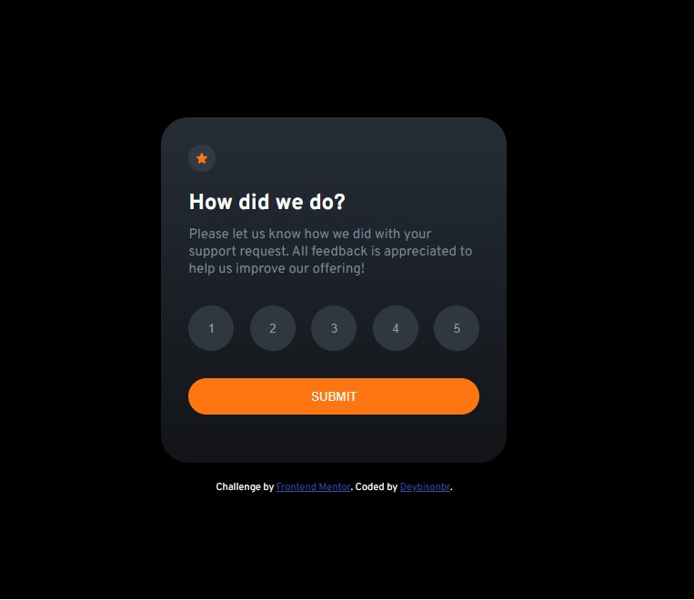

#Desafio Frontend Mentor - Interactive rating component

## Seja Bom Vindo! 👋

[Acesse o site para visualização!](https://deybisonbr.github.io/challenge-Interactive-hub/) Através desse link você poderá experimentar como funcionar o hub.

#Desafio: Criar um Hub interativo onde o usuario vai dar uma nota ao atendimento de 1 ao 5, ao clicar em um dos numeros e em submit, o hub vai retornar o valor que
o usuario selecionou e a nota maxima que pode ser selecionada.

Exemplo:
Esse projeto é um desafio do site [Front-end mentor](https://www.frontendmentor.io/home).

