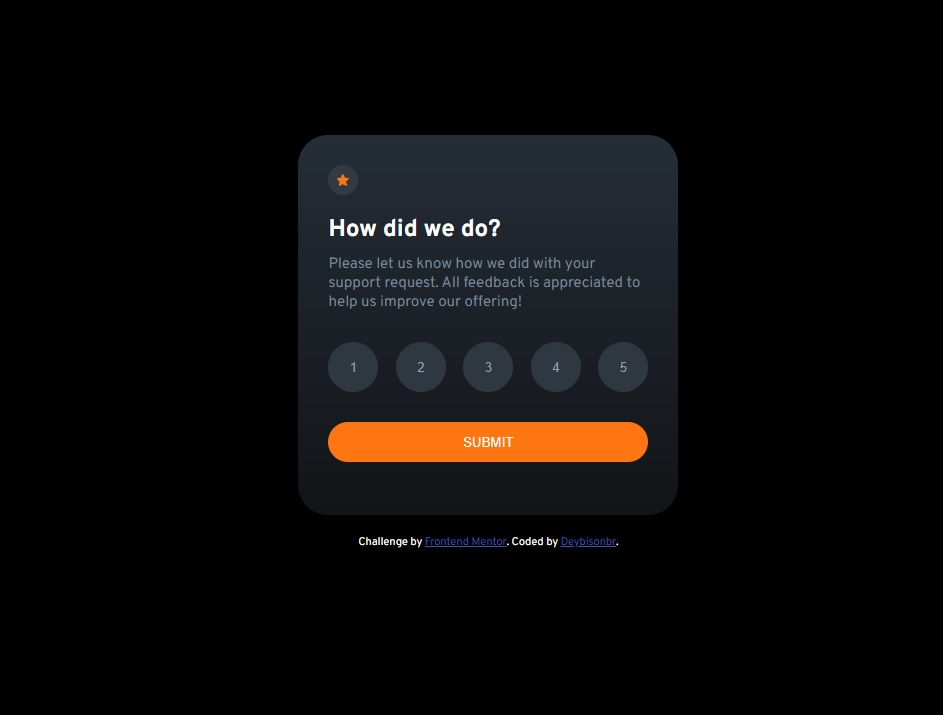
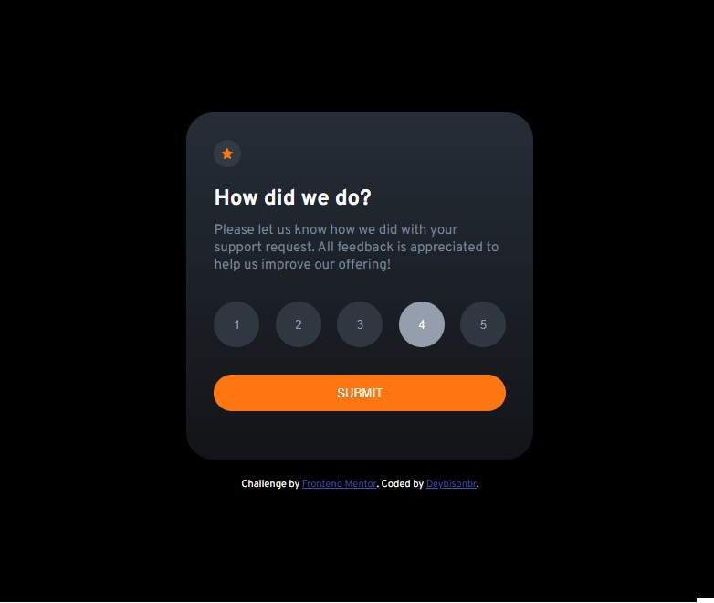
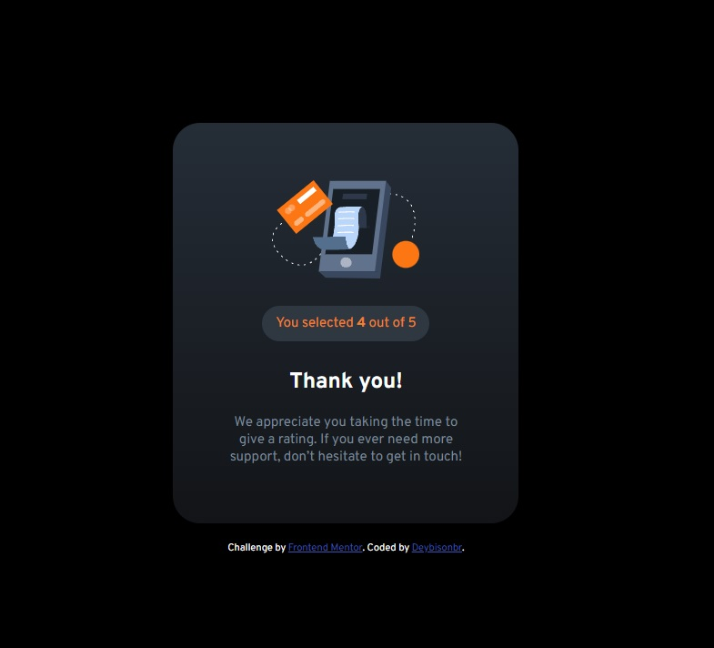

#Desafio Frontend Mentor - Interactive rating component
Tecnologias usadas:
*HTML5
*CSS3
*JavaScript

## Seja Bom Vindo! ??

[Acesse o site para visualização!](https://deybisonbr.github.io/challenge-Interactive-hub/) ao clicar nesse link você consegue interagir com esse hub através do GitHub Pages.

Desafio: Criar um Hub interativo onde o usuario vai dar uma nota ao atendimento de 1 ao 5, ao clicar em um dos numeros e em submit, o hub vai retornar o valor que
o usuario selecionou e a nota maxima que pode ser selecionada.

Exemplo:

Nessa etapa é onde o usuário vai selecionar a sua nota de 1 á 5:

Ao selecionar um dos numeros (exemplo 4) ficará em foco e mudará a cor para cinza:

Ao clicar em submit é retornado o hub muda onde é retornado a nota selecionada e o numero maximo da nota que o usuário pode selecionar:

